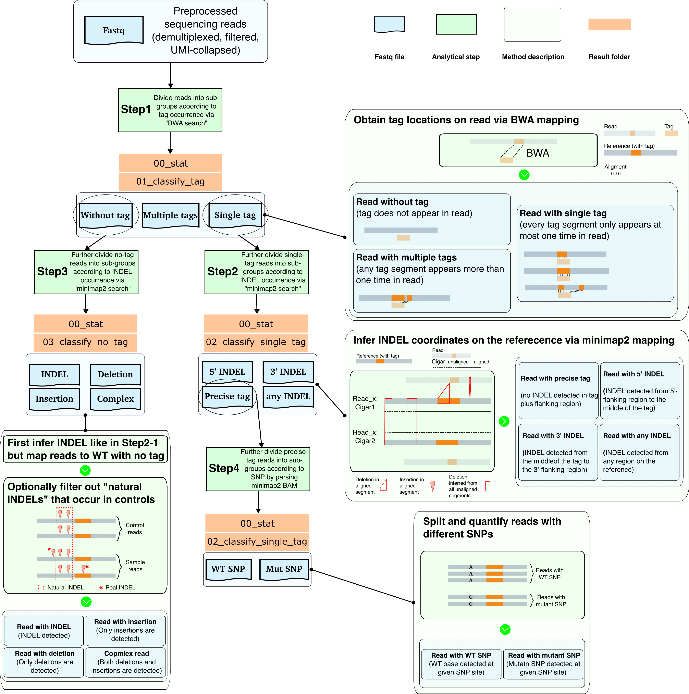

## Introduction

**sikiclass** is a bioinformatics pipeline designed for downstream classification analysis of UMI-collapsed reads produced by **sikipipe**.

<!-- TODO nf-core:
   Complete this sentence with a 2-3 sentence summary of what types of data the pipeline ingests, a brief overview of the
   major pipeline sections and the types of output it produces. You're giving an overview to someone new
   to nf-core here, in 15-20 seconds. For an example, see https://github.com/nf-core/rnaseq/blob/master/README.md#introduction
-->

<!-- TODO nf-core: Include a figure that guides the user through the major workflow steps. Many nf-core
     workflows use the "tube map" design for that. See https://nf-co.re/docs/contributing/design_guidelines#examples for examples.   -->
<!-- TODO nf-core: Fill in short bullet-pointed list of the default steps in the pipeline -->

The classification process involves several steps:
- `classify_tag` (Step 1): This step categorizes reads based on the occurrence of tag fragments.  
- `classify_single_tag` (Step 2): This step further subdivides reads containing a single tag into specific categories such as "precise_tag," "5' INDEL," "3' INDEL," etc.  
- `classify_no_tag` (Step 3): This step further divides reads without tags into categories like "Deletion," "Insertion," etc.  

Additionally, within the "precise_tag" category, reads are separated and counted based on different SNPs (Step 4). Finally, statistical tables are generated to summarize the proportions of each read category and to detail the size and distribution of INDELs.

The diagram below illustrates the method in detail. Specifially:
- `classify_tag` (Step 1): To determine if a tag appears in each read sequence, we use the short-read aligner BWA, treating the tag as the query and each read as the reference. By parsing the resulting BAM file, reads are classified as follows:  
   - "Without tag": No tag appears in the read.  
   - "With single tag": Each tag segment appears at most once in the read.  
   - "With multiple tags": Any tag segment appears more than once in the read.  
- `classify_single_tag` (Step 2) and `classify_no_tag` (Step 3): For further classification of "with single tag" reads and "without tag" reads respectively.  
   - "With single tag" reads are mapped against a reference with a precise tag inserted using the long-read aligner minimap2. Reads are classified as "with precise tag" if there are no INDELs in the tag and a predefined flanking region; otherwise, they are considered to have INDELs.  
   - "Without tag" reads are mapped against a wild-type reference that lacks the tag insertion. These reads are classified into sub-categories based on the occurrence of INDELs.  
- `stat_snp` (Step 4): For "precise tag" reads, they are split and counted according to the base species at a given SNP site.  

In addition to the split FASTQ files, **sikiclass** generates tables summarizing the proportions of each sub-category and the distributions of INDELs.

Refer to the [Usage](#usage) section for instructions on how to run **sikiclass**, and the [Output](#output) section for a detailed description of the result folders and files.

<p align="center">
  
</p>

## Usage

> [!NOTE]
> If you are new to Nextflow and nf-core, please refer to [this page](https://nf-co.re/docs/usage/installation) on how to set-up Nextflow. Make sure to [test your setup](https://nf-co.re/docs/usage/introduction#how-to-run-a-pipeline) with `-profile test` before running the workflow on actual data.

<!-- TODO nf-core: Describe the minimum required steps to execute the pipeline, e.g. how to prepare samplesheets.
     Explain what rows and columns represent. For instance (please edit as appropriate):

First, prepare a samplesheet with your input data that looks as follows:

`samplesheet.csv`:

```csv
sample,fastq_1,fastq_2
CONTROL_REP1,AEG588A1_S1_L002_R1_001.fastq.gz,AEG588A1_S1_L002_R2_001.fastq.gz
```

Each row represents a fastq file (single-end) or a pair of fastq files (paired end).

-->

Now, you can run the pipeline using:

<!-- TODO nf-core: update the following command to include all required parameters for a minimal example -->

```bash
git clone git@github.com:hukai916/sikiclass.git
cd sikiclass

# update conf/test_local.config by providing the correct samplesheet path, etc.
nextflow run main.nf -profile docker,arm -c conf/test_local.config
```

> [!WARNING]
> Please provide pipeline parameters via the CLI or Nextflow `-params-file` option. Custom config files including those provided by the `-c` Nextflow option can be used to provide any configuration _**except for parameters**_;
> see [docs](https://nf-co.re/usage/configuration#custom-configuration-files).

## Output

By default, all results are saved in the "./results" folder, as specified by the `outdir = "./results"` parameter in the master configuration file "nextflow.config". Results from different steps are organized into corresponding subdirectories (e.g. "./results/01_classify_tag", "./results/02_classify_single_tag", *etc.*), the "./results/00_stat" folder contains summary statistical tables.

Nextflow implements a caching mechanism that stores all intermediate and final results in the "./work/" directory. By default, files in the "./results/" are symbolic links to that in the "./work/". To switch from `symlink` to `copy`, use `publish_dir_mode = copy` argument. Below summarizes the main contents of each result folder.

### 00_stat  
This directory contains summary tables generated using the results of steps 1-4:

* `fq_class_ratios.tsv`: Provides the count fractions of each read class for each sample.
* `precise_tag_snp_fraction.tsv`: Provides the count fractions of different base species at given SNP site for "precise tag" reads for each sample.
* `no_tag_indel_size_distribution.tsv`: Shows the distribution of INDEL sizes for "no tag" reads.
* `no_tag_indel_size_location_to_pam`: Lists the INDEL size and their locations relative to the PAM site for "no tag" reads for each sample.

### 01_classify_tag  
This directory contains fastq files categorized based on tag occurrence:

* `01a_no_tag`: Fastq file for reads classified as having "no tag" for each sample.
* `01b_single_tag`: Fastq file for reads classified as having "single tag" for each sample.
* `01c_multiple_tag`: Fastq file for reads classified as having "multiple tag" for each sample.
* `01d_any_tag`: Fastq file for reads classified as having "any tag" for each sample (a union of 01b and 01c).
* `01e_tmp_fasta`: Intermediate fasta file.
* `01f_tmp_bam`: Intermedaite BAM file (from BWA).

### 02_classify_single_tag  
This directory contains fastq files categorized based on INDEL occurrence for "single tag" reads.

* `02a_precise_tag`: Fastq file for reads with "precise tag" for each sample.
* `02a_precise_tag_snp_wt`: Fastq file for reads classified as having "precise tag" that also contain WT base at given SNP site for each sample.
* `02a_precise_tag_snp_mut`: Fastq file for reads classified as having "precise tag" that also contain mutant base at given SNP site for each sample.
* `02b_5indel`: Fastq file for reads classified as having "INDELs in 5' region" for each sample.
* `02c_3indel`: Fastq file for reads classified as having "INDELs in 3' region" for each sample.
* `02d_any_indel`: Fastq file for reads classified as having "INDELs in any region" for each sample.
* `02e_tmp_bam`: Intermedaite BAM file (from minimap2).
* `02f_tmp_indel_pos`: Intermedaite file containing INDEL size and location information for each sample.

### 03_classify_no_tag  
This directory contains fastq files categorized based on INDEL occurrence for "no tag" reads.

* `03a_indel`: Fastq file for reads with "no tag" for each sample.
* `03b_deletion`: Fastq file for reads classified as having "deletions in any region" for each sample.
* `03c_insertion`: Fastq file for reads classified as having "insertions in any region" for each sample.
* `03d_tmp_bam`: Intermedaite BAM file (from minimap2).
* `03e_tmp_indel_pos`: Intermedaite file containing INDEL size and location information for each sample.

## Credits

**sikiclass** was originally designed and written by Kai Hu, Nathan Lawson, and Julie Zhu.

## Contributions and Support

If you would like to contribute to this pipeline, please see the [contributing guidelines](.github/CONTRIBUTING.md).

## Citations

<!-- TODO nf-core: Add citation for pipeline after first release. Uncomment lines below and update Zenodo doi and badge at the top of this file. -->
<!-- If you use hukai916/sikiclass for your analysis, please cite it using the following doi: [10.5281/zenodo.XXXXXX](https://doi.org/10.5281/zenodo.XXXXXX) -->

<!-- TODO nf-core: Add bibliography of tools and data used in your pipeline -->

An extensive list of references for the tools used by the pipeline can be found in the [`CITATIONS.md`](CITATIONS.md) file.

This pipeline uses code and infrastructure developed and maintained by the [nf-core](https://nf-co.re) community, reused here under the [MIT license](https://github.com/nf-core/tools/blob/master/LICENSE).

> **The nf-core framework for community-curated bioinformatics pipelines.**
>
> Philip Ewels, Alexander Peltzer, Sven Fillinger, Harshil Patel, Johannes Alneberg, Andreas Wilm, Maxime Ulysse Garcia, Paolo Di Tommaso & Sven Nahnsen.
>
> _Nat Biotechnol._ 2020 Feb 13. doi: [10.1038/s41587-020-0439-x](https://dx.doi.org/10.1038/s41587-020-0439-x).
